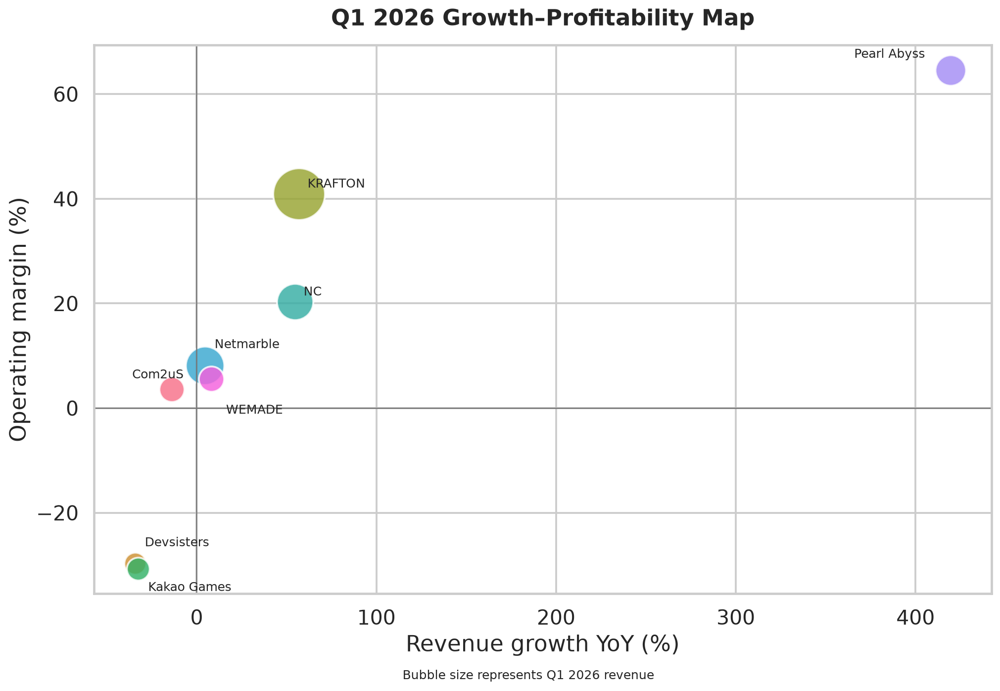

# Korean Game Companies: Open DART Financial Analysis

Open DART 공시를 이용해 한국 상장 게임사 8곳의 2025년 연간 실적과 2026년
1분기 재무 체력을 비교하는 재현 가능한 분석 프로젝트입니다.

분석 대상은 NC, Netmarble, KRAFTON, Kakao Games, Com2uS, Pearl Abyss,
WEMADE, Devsisters입니다. 일본 법인·일본 상장사인 Nexon은 DART 고유번호가
없어 제외했습니다.

## 핵심 결과

- KRAFTON: 2025년 매출 3.33조원으로 표본 1위
- KRAFTON: 2025년 영업이익률 31.7%로 표본 1위
- Pearl Abyss: 2026년 1분기 매출 전년 동기 대비 419.6% 증가
- NC: 2026년 1분기말 현금및현금성자산/자산 비율 23.0%로 표본 1위
- WEMADE는 영업이익 흑자 전환, Devsisters는 적자 전환

Pearl Abyss의 성장률은 낮은 전년 기저를 포함하므로 원인을 이 수치만으로
단정하지 않습니다. 본 분석은 투자 조언이 아닙니다.



## 산출물

- `collect_dart.py`: 2026년 DART 공시 목록과 선택적 원문 ZIP 수집
- `collect_financial_data.py`: 2025년 연간·2026년 1분기 연결재무제표 수집
- `build_kaggle_analysis.py`: 요약 테이블, 차트 5개, Kaggle 노트북 생성
- `analysis/charts/`: 게시용 PNG 차트
- `kaggle/dataset/`: Kaggle 데이터셋 CSV·메타데이터·데이터 사전
- `kaggle/notebook/`: 실행 가능한 Kaggle 노트북과 커널 메타데이터
- `tests/`: 수집 및 재무 계산 검증

## 재현 방법

Python 3.11 이상을 권장합니다.

```bash
python3 -m pip install -r requirements.txt
export OPENDART_API_KEY="발급받은_40자리_인증키"
```

공시 목록과 정기공시 원문 수집:

```bash
python3 collect_dart.py --start-date 20260101 --end-date 20260726
python3 collect_dart.py \
  --start-date 20260101 \
  --end-date 20260726 \
  --disclosure-type A \
  --download-originals
```

재무 CSV와 분석 산출물 생성:

```bash
python3 collect_financial_data.py --refresh
python3 build_kaggle_analysis.py
jupyter nbconvert \
  --to notebook \
  --execute kaggle/notebook/korean_game_companies_financial_health.ipynb \
  --inplace \
  --ExecutePreprocessor.timeout=120
```

테스트:

```bash
python3 -m unittest tests.test_collect_dart tests.test_financial_analysis -v
```

## 일본 게임사 EDINET 파이프라인

금융청 EDINET API v2를 이용해 일본 상장 게임 관련 기업 12사의 최근 5개년
연차·반기 연결재무제표를 수집할 수 있습니다. 대상은 Nexon, Nintendo, Capcom,
Square Enix, Koei Tecmo, Konami, Sega Sammy, Bandai Namco, Sony Group,
CyberAgent, GungHo, COLOPL입니다.

API 키를 환경변수로 설정하고, 필요하면 금융청 코드 목록으로 설정을 검증합니다.
키는 Raw 상태, URL, 매니페스트에 저장되지 않습니다.

```bash
export EDINET_API_KEY="발급받은_API_키"
curl -fsSL \
  https://disclosure2dl.edinet-fsa.go.jp/searchdocument/codelist/Edinetcode.zip \
  -o /tmp/Edinetcode.zip
python3 collect_edinet.py \
  --code-list /tmp/Edinetcode.zip \
  --history-years 5
```

특정 회사나 제출일 범위만 수집할 수도 있습니다.

```bash
python3 collect_edinet.py \
  --company capcom \
  --start-date 2026-06-01 \
  --end-date 2026-07-27
```

수집 후 공통 메타데이터와 EDINET 전용 Financial Silver·TTM Gold를 생성합니다.

```bash
python3 build_lakehouse_metadata.py
python3 build_edinet_financials.py
```

- Raw XBRL/CSV ZIP: `game_accounting_lake/raw/objects/`
- Financial Silver: `game_accounting_lake/silver/financial/CURRENT/`
- JPY TTM Gold: `game_accounting_lake/gold/edinet/CURRENT/`

2024년 제도 변경 이후 법정 1·3분기 보고서는 수집하지 않습니다. 과거 반기
연속성을 위해 2024년 이전 제2분기 누적보고서만 반기 자료로 취급합니다. 정정
공시와 재수집 관측은 새 행으로 보존하며, 분석 스냅샷에서만 최신 유효본을
선택합니다.

EDINET 파이프라인 테스트:

```bash
python3 -m unittest \
  tests.test_collect_edinet \
  tests.test_build_edinet_financials -v
```

## 분석 기준

- 모든 회사에 연결재무제표(`CFS`) 적용
- 2025년 사업보고서 코드 `11011`
- 2026년 1분기보고서 코드 `11013`
- 분기 비교는 보고서가 제공한 2025년 1분기 비교값 사용
- 연간 절대금액과 분기 절대금액을 직접 비교하지 않음
- 영업이익이 0을 가로지르면 증감률보다 흑자·적자 전환 상태를 우선 표시
- 금액 단위는 별도 표시가 없으면 KRW

원본 API 응답, 공시 원문, 실행 매니페스트, API 키는 GitHub와 Kaggle에
올리지 않습니다. `dart_data/`는 로컬에만 보존됩니다.

## 데이터 출처와 권리

데이터 출처는 금융감독원 [Open DART](https://opendart.fss.or.kr/)입니다.
공시검색 API와 단일회사 재무제표 API의 공개 응답을 분석용 CSV로 변환했고,
각 공시의 접수번호와 뷰어 URL을 보존했습니다.

코드는 [MIT License](LICENSE)로 배포합니다. 파생 데이터에는 코드 라이선스를
적용하지 않으며 Kaggle 라이선스는 `Other`로 지정합니다. 원 공시의 권리는
이 저장소가 부여하지 않습니다. 이용자는
[Open DART 이용약관](https://opendart.fss.or.kr/intro/terms.do)과 관련 법령을
따라야 합니다. Open DART/FSS와 공시 회사는 이 분석을 보증하지 않습니다.
